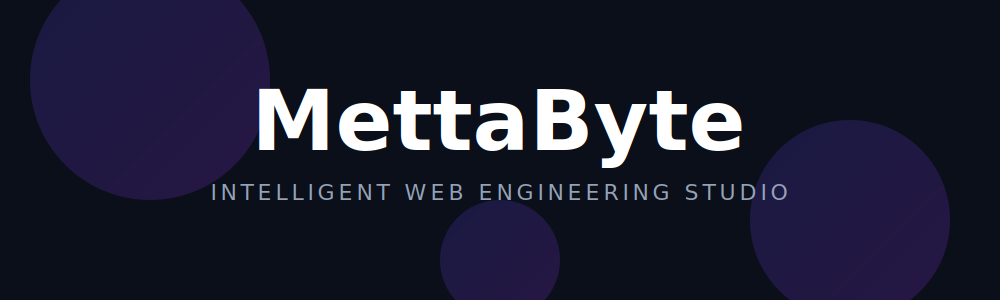

  

  <strong>Ship Intelligent, High-Performance Web Products Faster.</strong> 
  <i>Engineering Solutions with a Product Mindset — From Startups to Global Enterprises.</i>

  <a href="https://mettabyte.com"><strong>mettabyte.com</strong></a> | 
  <a href="https://www.linkedin.com/company/mettabyte"><strong>LinkedIn</strong></a> | 
  <a href="mailto:info@mettabyte.com"><strong>Email Us</strong></a>

---

## 🚀 The MettaByte Edge

What started as Sri Lankan university friends solving complex problems is now a full-stack engineering studio shipping production-grade software worldwide. Whether you are a **scaling startup** or a **global enterprise**, we bridge the gap between vision and reality.

### Our Core Expertise

<table width="100%">
  <tr>
    <td width="50%" align="center">
       
      <strong>INTELLIGENT WORKFLOWS (AI)</strong> 
      Autonomous AI agents and LLM integrations that automate complex business tasks 24/7.
    </td>
    <td width="50%" align="center">
       
      <strong>PREMIUM WEB EXPERIENCES</strong> 
      Stunning B2C/B2B websites & high-conversion portfolios built with Next.js and Framer-grade precision.
    </td>
  </tr>
  <tr>
    <td width="50%" align="center">
       
      <strong>IT SOLUTIONS & SUPPORT</strong> 
      Strategic IT consulting, cloud migrations, and hands-on technical support for businesses of all sizes.
    </td>
    <td width="50%" align="center">
       
      <strong>GLOBAL SCALE & PERFORMANCE</strong> 
      Edge computing and optimized deployments ensuring instant load times anywhere on the planet.
    </td>
  </tr>
</table>

---

## 🛠️ Our Tech Ecosystem

We build with the best to ensure your product is scalable, secure, and future-proof.

  
  
  
  
  
  
  

---

  <h3>Ready to scale your vision?</h3>
  
Let's discuss how our engineering team can help you ship faster and better.

  

 

<i>MettaByte © 2026. Built globally, communicated locally.</i>

